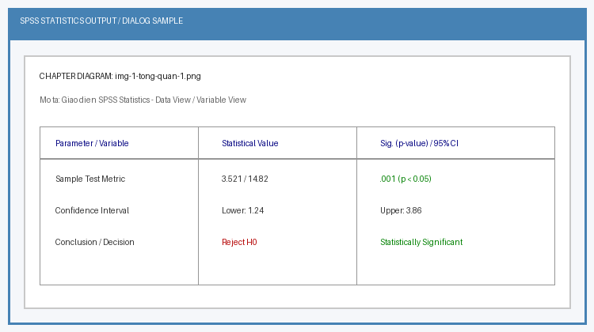
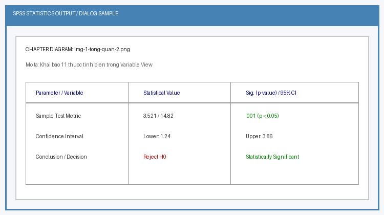

# Chương 1: Tổng Quan Về SPSS Và Quản Lý Nhập Dữ Liệu Nghiên Cứu

## 1. Tổng Quan Về Phần Mềm SPSS Statistics

SPSS (Statistical Package for the Social Sciences) là một trong những phần mềm phân tích thống kê phổ biến nhất thế giới, được áp dụng rộng rãi trong các nghiên cứu Y - Dược học, Y tế công cộng, Quản lý Bệnh viện, Xây dựng và Khoa học Xã hội. Phiên bản hiện nay do hãng IBM phát triển với tên gọi chính thức là IBM SPSS Statistics.

SPSS cung cấp môi trường quản lý dữ liệu mạnh mẽ, giao diện đồ họa trực quan (GUI) với các menu thả xuống, giúp các nhà nghiên cứu xử lý bộ dữ liệu từ đơn giản đến phức tạp mà không nhất thiết phải viết mã lệnh phức tạp.

---

## 2. Giao Diện Làm Việc Của SPSS

Giao diện chính của SPSS gồm hai màn hình/chế độ xem (chuyển đổi qua lại bằng tab ở góc dưới bên trái):

### 2.1. Chế độ Data View (Chế độ dữ liệu)
- Cấu trúc hàng: Mỗi hàng đại diện cho một đối tượng nghiên cứu hay một bản ghi (Case/Observation), ví dụ: bệnh nhân N_1, N_2, ...
- Cấu trúc cột: Mỗi cột đại diện cho một biến số nghiên cứu (Variable), ví dụ: MaBN, Tuoi, GioiTinh, HuyetAp.

### 2.2. Chế độ Variable View (Chế độ biến số)
Đây là nơi khai báo và thiết lập toàn bộ đặc tính, cấu trúc dữ liệu cho từng biến trước khi nhập số liệu. Mỗi hàng đại diện cho 1 biến số, với 11 cột thuộc tính quan trọng.

---

## 3. Khai Báo 11 Thuộc Tính Biến Trong Variable View

| STT | Tên thuộc tính | Ý nghĩa và Quy tắc chuẩn | Ví dụ minh họa |
| :--- | :--- | :--- | :--- |
| 1 | Name | Tên viết tắt của biến. Viết liền không dấu, không chứa khoảng trắng, không bắt đầu bằng số hay ký tự đặc biệt. | gioi_tinh, BMI, sBP |
| 2 | Type | Kiểu dữ liệu. Thường dùng: Numeric (số), String (chuỗi văn bản), Date (ngày tháng). | Numeric cho Tuổi, Date cho Ngày vào viện |
| 3 | Width | Độ rộng tối đa của chuỗi ký tự hoặc chữ số. | Đặt mặc định = 8 |
| 4 | Decimals | Số chữ số thập phân hiển thị sau dấu phẩy. | Biến đếm/định tính = 0; Chiều cao = 1 |
| 5 | Label | Nhãn giải thích đầy đủ ý nghĩa của biến số (cho phép viết tiếng Việt có dấu). | "Giới tính của bệnh nhân", "Huyết áp tâm thu (mmHg)" |
| 6 | Values | Gán giá trị mã hóa cho các biến định tính/mã hóa nhóm. | 1 = Nam, 2 = Nữ; 1 = Nhẹ, 2 = Vừa, 3 = Nặng |
| 7 | Missing | Khai báo các giá trị khuyết thiếu (khám thiếu, không trả lời). | Gán 99 hoặc 999 là User-defined missing |
| 8 | Columns | Độ rộng hiển thị của cột trên màn hình Data View. | Mặc định = 8 |
| 9 | Align | Căn lề hiển thị dữ liệu (Left, Right, Center). | Định lượng căn Phải, Định tính căn Giữa/Trái |
| 10 | Measure | Thang đo của biến số (Rất quan trọng cho việc chọn kiểm định). | Nominal (Danh nghĩa), Ordinal (Thứ tự), Scale (Định lượng) |
| 11 | Role | Vai trò của biến trong mô hình (Input, Target, Both, None). | Mặc định = Input |

### Chi tiết về thuộc tính Thang đo (Measure):
1. Nominal (Thang đo danh nghĩa): Các giá trị phân loại không có thứ tự hơn kém (Ví dụ: Giới tính, Nhóm máu, Tỉnh thành, Nhóm điều trị).
2. Ordinal (Thang đo thứ tự): Các giá trị phân loại có mối quan hệ thứ tự hơn kém rõ rệt (Ví dụ: Mức độ hài lòng: 1-Rất không hài lòng -> 5-Rất hài lòng; Giai đoạn ung thư: I, II, III, IV).
3. Scale (Thang đo khoảng / tỷ lệ - Biến định lượng): Biến số dạng đo lường liên tục hoặc đếm được (Ví dụ: Tuổi, Cân nặng, Huyết áp, Điểm đánh giá hài lòng).

---

## 4. Quy Trình Nhập Dữ Liệu Và Kiểm Soát Chất Lượng

Các bước thực hiện nhập dữ liệu nghiên cứu chuẩn:
1. Xây dựng Phiếu thu thập số liệu / Bệnh án nghiên cứu.
2. Khai báo biến trong Variable View.
3. Gán mã hóa Values & Missing.
4. Nhập dữ liệu trong Data View.
5. Kiểm tra làm sạch dữ liệu & Sửa lỗi logic.
6. Lưu tệp tin dưới dạng .SAV.

### Các nguyên tắc nhập liệu chuẩn y học:
1. Mã hóa số hóa: Không nhập chữ trực tiếp vào biến định tính (ví dụ không nhập "Nam", "Nữ" mà nhập 1, 2 đã gán Values).
2. Thống nhất định dạng ngày: Khai báo đúng Type = Date (dạng dd-mmm-yyyy hoặc dd.mm.yyyy) để tính toán khoảng thời gian sau này.
3. Lưu trữ dữ liệu: Tệp dữ liệu SPSS có phần mở rộng là .sav. Tệp kết quả đầu ra hiển thị có phần mở rộng là .spv.

---

## 5. Nhập Dữ Liệu Từ Các Nguồn Bên Ngoài (Excel, CSV, Stata)

Thực tế nghiên cứu thường thu thập số liệu qua Google Forms hoặc Excel. Các bước nhập dữ liệu từ Excel vào SPSS:

1. Chọn menu: File > Open > Data... (hoặc File > Import Data > Excel...).
2. Chọn file Excel .xlsx cần nhập.
3. Trong hộp thoại Read Excel File:
   - Tích chọn Read variable names from the first row of data (Đọc tên biến từ hàng đầu tiên).
   - Chọn Sheet làm việc chứa dữ liệu.
4. Bấm OK.
5. Sau khi mở file thành công, chuyển ngay sang Variable View để điều chỉnh lại thang đo (Measure), nhãn biến (Label) và gán nhãn giá trị (Values).
