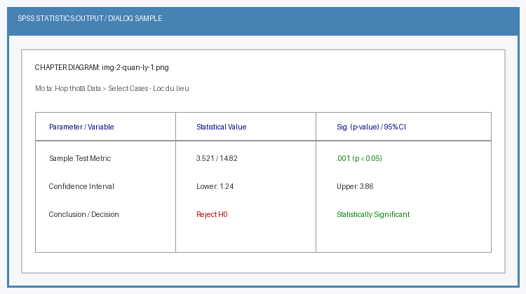
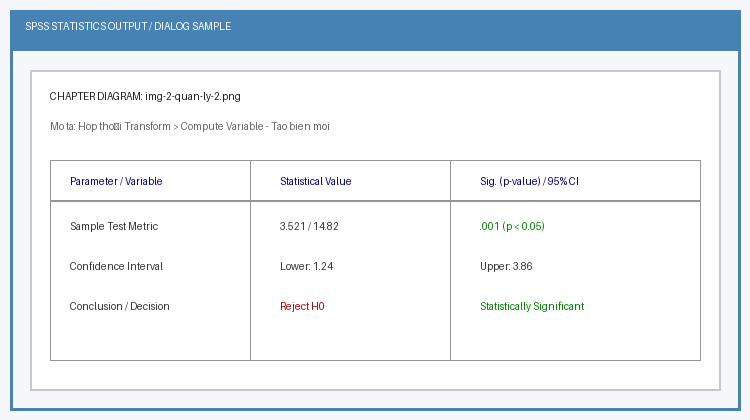
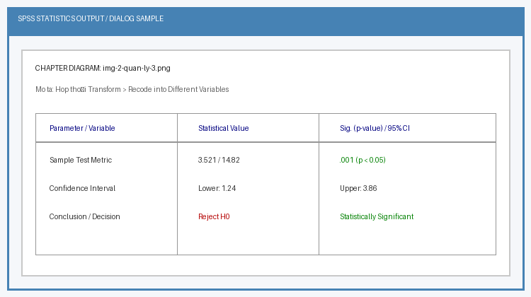

# Chương 2: Quản Lý Và Biến Đổi Dữ Liệu Trong SPSS

Trong phân tích số liệu nghiên cứu, bước chuẩn bị và xử lý dữ liệu trước khi chạy các thuật toán thống kê chiếm tới 60% - 70% thời gian. Chương này trình bày các kỹ thuật biến đổi, lọc, mã hóa và quản lý dữ liệu chuyên sâu trong SPSS.

---

## 1. Lọc Và Chọn Lọc Bản Ghi Nghiên Cứu (Select Cases)

Lệnh Select Cases được sử dụng khi nghiên cứu viên chỉ muốn thực hiện phân tích trên một phân nhóm đối tượng cụ thể (ví dụ: chỉ phân tích bệnh nhân Nam, hoặc bệnh nhân từ 60 tuổi trở lên có đái tháo đường).

### Thao tác thực hiện:
1. Vào menu: Data > Select Cases...
2. Chọn tiêu chí lọc trong hộp thoại:
   - All cases: Chọn tất cả các bản ghi (hủy bỏ mọi bộ lọc trước đó).
   - If condition is satisfied: Lọc theo điều kiện logic (Bấm nút If... để nhập công thức).
   - Random sample of cases: Chọn ngẫu nhiên một tỷ lệ hoặc số lượng bản ghi nhất định.
   - Based on time or case range: Chọn theo khoảng hàng (ví dụ từ hàng 1 đến 100).
3. Lựa chọn xử lý bản ghi không thỏa mãn (Output):
   - Filter out unselected cases: Giữ nguyên toàn bộ dữ liệu, chỉ gạch ngang (loại tạm thời) các bản ghi không thỏa mãn. (Khuyên dùng)
   - Copy unselected cases to a new dataset: Trích xuất nhóm thỏa mãn sang một tập dữ liệu mới.
   - Delete unselected cases: Xóa vĩnh viễn các bản ghi không thỏa mãn khỏi bộ dữ liệu. (Cần cẩn trọng)

### Cú pháp điều kiện If phổ biến:
- Lọc bệnh nhân Nam: `gioi_tinh = 1`
- Lọc bệnh nhân trên 60 tuổi và có tăng huyết áp: `tuoi >= 60 AND huyet_ap = 1`
- Lọc nhóm tuổi thanh niên hoặc người già: `tuoi < 30 OR tuoi >= 60`

---

## 2. Sắp Xếp Dữ Liệu (Sort Cases)

Lệnh Sort Cases sắp xếp lại thứ tự các bản ghi theo thứ tự tăng dần (Ascending) hoặc giảm dần (Descending) của một hoặc nhiều biến số.

### Thao tác thực hiện:
1. Vào menu: Data > Sort Cases...
2. Chuyển biến cần sắp xếp vào ô Sort by.
3. Chọn chiều sắp xếp: Ascending (A-Z, 0-9) hoặc Descending (Z-A, 9-0).
4. Bấm OK.

Lưu ý: Sắp xếp dữ liệu không làm thay đổi hay mất mát kết quả phân tích thống kê, nhưng rất hữu ích để phát hiện các giá trị bất thường (Outliers) hoặc chuẩn bị cho việc ghép file.

---

## 3. Tạo Biến Mới Dựa Trên Công Thức Toán Học (Compute Variable)

Lệnh Compute Variable được dùng để tạo ra một biến số mới dựa trên tính toán toán học hoặc hàm logic từ các biến số đã có sẵn.

### Ví dụ 1: Tính Chỉ số Khối Cơ thể (BMI)
- Công thức: BMI = Cân nặng (kg) / (Chiều cao (m))^2 = can_nang / ((chieu_cao / 100)^2)
- Thao tác:
  1. Vào menu: Transform > Compute Variable...
  2. Tại Target Variable: Nhập tên biến mới (BMI).
  3. Bấm Type & Label... để gán nhãn "Chỉ số khối cơ thể (kg/m2)".
  4. Tại Numeric Expression: Nhập `can_nang / ((chieu_cao / 100) ** 2)`
  5. Bấm OK.

### Ví dụ 2: Tính Tuổi từ Ngày Sinh và Ngày Vào Viện
- Sử dụng nhóm hàm Date Arithmetic trong SPSS: `DATEDIFF(ngay_vao_vien, ngay_sinh, 'years')`.

---

## 4. Mã Hóa Và Phân Nhóm Biến Số (Recode Variables)

Mã hóa biến số là thao tác chuyển đổi một biến định lượng liên tục thành biến định tính phân nhóm (ví dụ: chuyển biến Tuổi thành 3 nhóm tuổi, hoặc biến BMI thành 4 nhóm phân loại WHO).

Quy tắc: Luôn chọn Recode into Different Variables (Mã hóa thành biến mới) để bảo toàn biến gốc ban đầu. Không dùng Recode into Same Variables trừ khi thực sự cần đè lên dữ liệu cũ.

### Ví dụ: Phân nhóm chỉ số BMI theo chuẩn WHO Châu Á:
- BMI < 18.5: Gầy (Mã = 1)
- 18.5 <= BMI < 23.0: Bình thường (Mã = 2)
- 23.0 <= BMI < 25.0: Thừa cân (Mã = 3)
- BMI >= 25.0: Béo phì (Mã = 4)

### Thao tác thực hiện:
1. Vào menu: Transform > Recode into Different Variables...
2. Đưa biến BMI vào ô Input Variable -> Output Variable.
3. Tại phần Output Variable:
   - Name: Nhập `nhom_BMI`
   - Label: Nhập "Phân nhóm BMI"
   - Bấm Change.
4. Bấm nút Old and New Values...:
   - Range Lowest through 18.49 -> New Value = 1 -> Add
   - Range 18.50 through 22.99 -> New Value = 2 -> Add
   - Range 23.00 through 24.99 -> New Value = 3 -> Add
   - Range 25.00 through highest -> New Value = 4 -> Add
5. Bấm Continue -> OK.
6. Vào Variable View, tại dòng nhom_BMI, gán Values: 1 = Gầy, 2 = Bình thường, 3 = Thừa cân, 4 = Béo phì.

---

## 5. Tách Và Ghép File Dữ Liệu (Split File & Merge Files)

### 5.1. Tách tệp phân tích (Split File)
Lệnh Split File cho phép chia bộ dữ liệu thành các nhóm nhỏ dựa trên một biến định tính để khi chạy bất kỳ phân tích nào, SPSS cũng sẽ xuất kết quả độc lập cho từng nhóm.

- Thao tác: Data > Split File...
- Chọn Compare groups hoặc Organize output by groups.
- Chuyển biến phân nhóm (ví dụ: gioi_tinh) vào ô Groups Based on.
- Lưu ý: Sau khi hoàn thành phân tích, cần vào lại Data > Split File... và chọn Analyze all cases, do not create groups để hủy bỏ trạng thái tách.

### 5.2. Ghép tệp dữ liệu (Merge Files)
- Ghép thêm bản ghi (Data > Merge Files > Add Cases...): Dùng khi nghiên cứu thực hiện thu thập dữ liệu ở nhiều trung tâm khác nhau có cùng cấu trúc biến số, cần gộp chung các bệnh nhân lại với nhau.
- Ghép thêm biến số (Data > Merge Files > Add Variables...): Dùng khi cùng một tập đối tượng nhưng có thêm bộ công cụ xét nghiệm/đánh giá bổ sung, ghép nối thông qua mã định danh chung (Key Variable như MaBN).
