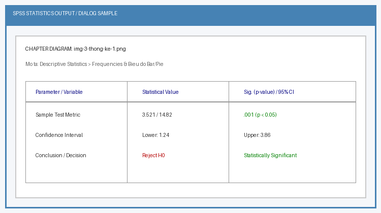
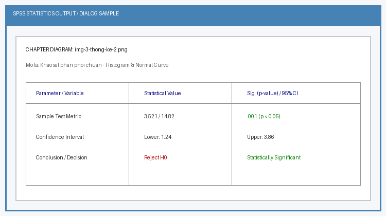
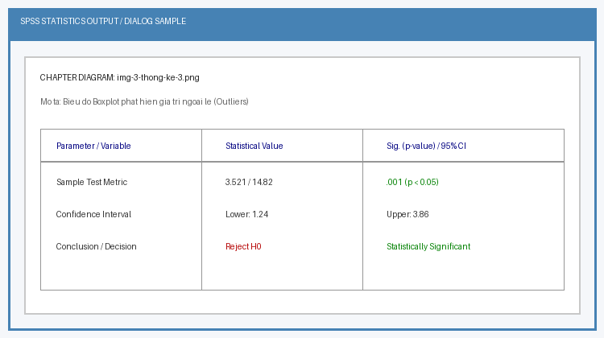

# Chương 3: Thống Kê Mô Tả Và Trình Bày Dữ Liệu Nghiên Cứu

Thống kê mô tả (Descriptive Statistics) là bước đầu tiên và bắt buộc trong mọi công trình nghiên cứu khoa học. Mục tiêu của chương này là tóm tắt, tổng hợp và trình bày các đặc tính cơ bản của dữ liệu thu thập được thông qua các chỉ số thống kê và biểu đồ trực quan.

---

## 1. Phân Loại Biến Số Trong Nghiên Cứu

Trước khi tiến hành phân tích, nghiên cứu viên cần xác định chính xác bản chất của biến số:

1. Biến định tính (Categorical Variables):
   - Danh nghĩa (Nominal): Giới tính, Nhóm máu, Tỉnh thành.
   - Thứ tự (Ordinal): Giai đoạn ung thư, Mức độ đau (Nhẹ, Vừa, Nặng).
2. Biến định lượng (Quantitative Variables):
   - Rời rạc (Discrete): Số con, Số ngày nằm viện.
   - Liên tục (Continuous): Tuổi, Cân nặng, Huyết áp, Chiều cao.

---

## 2. Thống Kê Mô Tả Biến Định Tính

### 2.1. Các chỉ số cần báo cáo
- Tần số (n - Frequency): Số lượng quan sát xuất hiện ở mỗi biểu hiện.
- Tỷ lệ phần trăm (%):
  - Percent: Tỷ lệ phần trăm tính trên tổng số bản ghi (bao gồm cả giá trị missing).
  - Valid Percent: Tỷ lệ phần trăm chỉ tính trên số bản ghi hợp lệ (đã loại trừ missing). Luôn báo cáo chỉ số Valid Percent.

### 2.2. Biểu đồ mô tả
- Biểu đồ cột rời (Bar Chart): Thích hợp cho biến định tính danh nghĩa hoặc thứ tự.
- Biểu đồ hình tròn (Pie Chart): Thích hợp khi biến định tính có ít phân loại (<= 5 nhóm) và tổng các tỷ lệ bằng 100%.

### 2.3. Lệnh SPSS
- Thực hiện: Analyze > Descriptive Statistics > Frequencies...
- Chuyển các biến định tính cần mô tả vào ô Variable(s).
- Đảm bảo tích chọn Display frequency tables.
- Vào nút Charts...: Chọn Bar charts hoặc Pie charts -> Choose Percentages -> Continue -> OK.

---

## 3. Thống Kê Mô Tả Biến Định Lượng Và Khảo Sát Phân Phối Chuẩn

Để báo cáo biến định lượng một cách chính xác, điều kiện tiên quyết là phải đánh giá xem biến số đó có tuân theo Phân phối chuẩn (Normal Distribution) hay không.

### 3.1. Các tiêu chí đánh giá Phân phối chuẩn
Một biến định lượng được coi là có phân phối chuẩn hoặc xấp xỉ chuẩn khi thỏa mãn các điều kiện sau:

1. Về mặt chỉ số thống kê:
   - Giá trị Trung bình (Mean) và Trung vị (Median) xấp xỉ bằng nhau (chênh lệch không quá 10%).
   - Giá trị Mean +- 3*SD chứa hầu hết toàn bộ dải dữ liệu (Min - Max).
   - System Skewness (Độ lệch) và Kurtosis (Độ nhọn) nằm trong khoảng từ -1.0 đến +1.0.
2. Về mặt biểu đồ:
   - Biểu đồ cột liên tục (Histogram) có dạng hình chuông đối xứng ở giữa, thấp dần về 2 phía.
   - Biểu đồ Q-Q Plot: Các điểm dữ liệu nằm sát trên đường chéo chuẩn.
3. Kiểm định giả thuyết phân phối chuẩn:
   - Kiểm định Kolmogorov-Smirnov (khi cỡ mẫu N >= 50) hoặc Shapiro-Wilk (khi cỡ mẫu N < 50).
   - Nếu p > 0.05: Chấp nhận giả thuyết H0 -> Biến số có phân phối chuẩn.
   - Nếu p <= 0.05: Bác bỏ H0 -> Biến số có phân phối KHÔNG chuẩn.

### 3.2. Cách trình bày chỉ số thống kê trong báo cáo y học

| Phân phối dữ liệu | Chỉ số tập trung | Chỉ số phân tán | Trình bày chuẩn bài báo khoa học |
| :--- | :--- | :--- | :--- |
| Phân phối Chuẩn | Trung bình (Mean) | Độ lệch chuẩn (SD) | Mean +- SD (Ví dụ: 45.2 +- 8.6 tuổi) |
| Phân phối Không chuẩn | Trung vị (Median) | Khoảng tứ phân vị (IQR) / Min-Max | Median (IQR) (Ví dụ: 5.8 (4.2 - 8.1) mg/dL) |

### 3.3. Biểu đồ mô tả biến định lượng
- Histogram (Cột liên tục): Thể hiện hình dạng phân phối.
- Boxplot (Biểu đồ hộp & râu): Giúp phát hiện trung vị, khoảng tứ phân vị và các giá trị ngoại lệ (Outliers).

### 3.4. Lệnh SPSS khảo sát phân phối chuẩn
- Thực hiện: Analyze > Descriptive Statistics > Explore...
- Chuyển biến định lượng vào Dependent List.
- Bấm Plots...: Tích chọn Histogram và Normality plots with tests.
- Bấm Continue -> OK.

---

## 4. Mô Tả Mối Quan Hệ Giữa Hai Biến Số (Hai chiều)

### 4.1. Một biến Định tính x Một biến Định tính
- Chỉ số báo cáo: Bảng chéo tần số và tỷ lệ phần trăm (Crosstabs).
- Thao tác SPSS: Analyze > Descriptive Statistics > Crosstabs...
  - Đưa biến độc lập (nguyên nhân/nguy cơ) vào Row(s).
  - Đưa biến phụ thuộc (kết cục/bệnh lý) vào Column(s).
  - Vào Cells...: Chọn Row (Tỷ lệ phần trăm theo dòng) -> Continue -> OK.
- Biểu đồ: Biểu đồ cột chồng (Stacked Bar Chart) hoặc Biểu đồ cột ghép (Clustered Bar Chart).

### 4.2. Một biến Định tính x Một biến Định lượng
- Chỉ số báo cáo: Trung bình, độ lệch chuẩn (hoặc Trung vị, IQR) của biến định lượng theo từng nhóm định tính.
- Thao tác SPSS: Analyze > Reports > Case Summaries...
  - Biến định lượng đưa vào Variables.
  - Biến định tính phân nhóm đưa vào Grouping Variable(s).
  - Vào Statistics...: Chọn Mean, Standard Deviation, Median, Group Midspread (IQR).
- Biểu đồ: Biểu đồ Hộp theo nhóm (Legacy Dialogs > Boxplot > Simple > Summaries for groups of cases).

### 4.3. Hai biến Định lượng
- Chỉ số báo cáo: Hệ số tương quan Pearson (r) hoặc Spearman (rho).
- Thao tác SPSS: Analyze > Correlate > Bivariate...
- Biểu đồ: Biểu đồ phân tán Scatterplot (Graphs > Legacy Dialogs > Scatter/Dot... > Simple Scatter).
