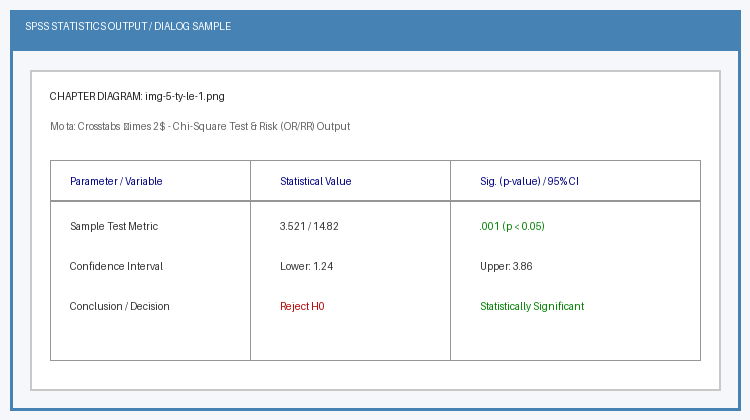
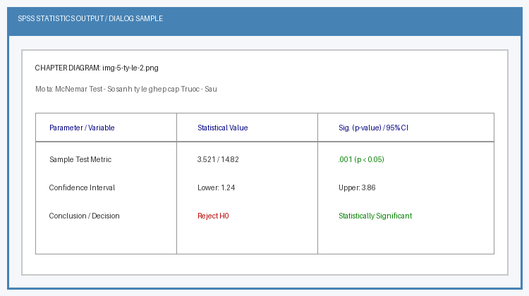

# Chương 5: Kiểm Định Giả Thuyết Cho Biến Định Tính Và Tỷ Lệ

Trong các nghiên cứu y tế công cộng, dịch tễ học và quản lý y tế, các chỉ số tỷ lệ (như tỷ lệ mắc bệnh, tỷ lệ khỏi bệnh, tỷ lệ hài lòng, tỷ lệ tuân thủ) đóng vai trò vô cùng quan trọng. Chương này trình bày chi tiết các phương pháp kiểm định phi tham số (Non-parametric Tests) để kiểm định tỷ lệ và khảo sát mối liên quan giữa các biến định tính.

---

## 1. Kiểm Định Giả Thuyết Cho Một Giá Trị Tỷ Lệ (Binomial Test)

### 1.1. Mục đích
So sánh tỷ lệ quan sát được từ nghiên cứu (p) với một tỷ lệ chuẩn/lý thuyết (p_0) đã cho trước.

### 1.2. Ví dụ thực tế
Ví dụ: Tỷ lệ cán bộ y tế hài lòng với công việc trong nghiên cứu năm 2015 có khác biệt so với tỷ lệ mục tiêu 70% (0.70) không?
- H0: p = 0.70
- Ha: p != 0.70

### 1.3. Thao tác SPSS
1. Vào menu: Analyze > Nonparametric Tests > Legacy Dialogs > Binomial...
2. Chuyển biến định tính nhị phân (hai_long: 1 = Hài lòng, 0 = Không hài lòng) vào ô Test Variable List.
3. Tại ô Test Proportion: Nhập giá trị so sánh = 0.70.
4. Bấm OK.

### 1.4. Đọc kết quả Output
- Đọc bảng Binomial Test:
  - Xem tỷ lệ quan sát Observed Prop..
  - Đọc p-value tại cột Exact Sig. (2-tailed) hoặc Exact Sig. (1-tailed).
  - Kết luận: Nếu Exact Sig. < 0.05 -> Bác bỏ H0. Tỷ lệ hài lòng thực tế của CBYT trong nghiên cứu (52%) thấp hơn có ý nghĩa thống kê so với tỷ lệ chuẩn 70% (p < 0.001).

---

## 2. Kiểm Định Mối Liên Quan Giữa Hai Biến Định Tính Độc Lập (Chi-Square Test - Khi bình phương)

Kiểm định Khi bình phương được sử dụng để kiểm định xem có mối liên quan giữa 2 biến định tính độc lập hay không.

### 2.1. Quy tắc chọn kiểm định Khi bình phương trong Bảng 2x2

Đối với bảng 2x2 (mỗi biến có đúng 2 giá trị phân loại), việc đọc kết quả phụ thuộc vào tần số kỳ vọng (Expected Count - E_ij) ở các ô:

1. Điều kiện 1: Tất cả các ô đều có E_ij >= 5 và cỡ mẫu N > 40 -> Đọc kết quả Pearson Chi-Square.
2. Điều kiện 2: Tất cả các ô đều có E_ij >= 5 nhưng cỡ mẫu N <= 40 -> Đọc kết quả Continuity Correction (hiệu chỉnh Yates).
3. Điều kiện 3: Có ít nhất 1 ô có E_ij < 5 (hoặc tổng cỡ mẫu quá nhỏ) -> Đọc kết quả Fisher's Exact Test (Kiểm định chính xác Fisher).

### 2.2. Quy tắc cho Bảng n xm (Bảng lớn hơn 2x2)
- Bắt buộc không được có quá 20% số ô có tần số kỳ vọng E_ij < 5 và không ô nào có E_ij < 1.
- Nếu thỏa mãn điều kiện -> Đọc hàng Pearson Chi-Square (hàng đầu tiên).
- Nếu không thỏa mãn -> Cần gộp nhóm biến số hoặc dùng kiểm định chính xác Monte Carlo/Fisher-Freeman-Halton.

### 2.3. Thao tác SPSS
1. Vào menu: Analyze > Descriptive Statistics > Crosstabs...
2. Đưa biến độc lập (yếu tố nguy cơ) vào Row(s).
3. Đưa biến phụ thuộc (bệnh lý/kết cục) vào Column(s).
4. Bấm Statistics...:
   - Tích chọn Chi-square.
   - Tích chọn Risk (Để tính Odds Ratio và Relative Risk cho bảng 2x2).
   - Bấm Continue.
5. Bấm Cells...:
   - Tích chọn Observed (Tần số quan sát) và Expected (Tần số kỳ vọng).
   - Mục Percentages: Tích chọn Row (Tỷ lệ phần trăm theo dòng).
   - Bấm Continue.
6. Bấm OK.

---

## 3. Đánh Giá Mức Độ Liên Quan: Tỷ Số Chênh (OR) Và Nguy Cơ Tương Đối (RR)

Khi kiểm định Khi bình phương cho thấy có mối liên quan (p < 0.05) trong bảng 2x2, chúng ta cần xác định chiều hướng và độ mạnh của mối liên quan thông qua chỉ số OR hoặc RR.

### 3.1. Định nghĩa và Công thức

| Bảng 2x2 | Bệnh (+ / Case) | Không bệnh (- / Control) | Tổng |
| :--- | :--- | :--- | :--- |
| Có tiếp xúc nguy cơ (+) | a | b | a + b |
| Không tiếp xúc nguy cơ (-) | c | d | c + d |

- Odds Ratio (Tỷ số chênh - OR): Thích hợp cho thiết kế nghiên cứu bệnh - chứng (Case-Control Study).
  OR = (a / b) / (c / d) = (a * d) / (b * c)
- Relative Risk (Nguy cơ tương đối - RR): Thích hợp cho thiết kế nghiên cứu đoàn hệ (Cohort Study) hoặc nghiên cứu can thiệp.
  RR = [a / (a + b)] / [c / (c + d)]

### 3.2. Phiên giải giá trị OR / RR và Khoảng tin cậy 95% (95% CI)
- OR / RR > 1: Yếu tố tiếp xúc là Yếu tố nguy cơ (tăng khả năng mắc bệnh).
- OR / RR = 1: Không có mối liên quan giữa yếu tố tiếp xúc và bệnh.
- OR / RR < 1: Yếu tố tiếp xúc là Yếu tố bảo vệ (giảm khả năng mắc bệnh).

Quy tắc đọc Khoảng tin cậy 95% CI:
- Nếu khoảng 95% CI của OR/RR KHÔNG chứa giá trị 1.0 (Ví dụ: OR = 2.4, 95% CI: 1.3 - 4.2) -> Mối liên quan có ý nghĩa thống kê (p < 0.05).
- Nếu khoảng 95% CI chứa giá trị 1.0 (Ví dụ: OR = 1.5, 95% CI: 0.8 - 2.8) -> Mối liên quan không có ý nghĩa thống kê (p >= 0.05).

---

## 4. Kiểm Định Giả Thuyết Cho Hai Tỷ Lệ Ghép Cặp (McNemar Test)

### 4.1. Mục đích
So sánh tỷ lệ hiện mắc hay tỷ lệ đạt của cùng một nhóm đối tượng tại 2 thời điểm khác nhau (Trước vs Sau can thiệp) đối với biến định tính nhị phân.

### 4.2. Thao tác SPSS
1. Vào menu: Analyze > Descriptive Statistics > Crosstabs...
2. Đưa biến thời điểm 1 (truoc_can_thiep) vào Row(s).
3. Đưa biến thời điểm 2 (sau_can_thiep) vào Column(s).
4. Bấm nút Statistics...: Tích chọn McNemar.
5. Bấm Continue -> OK.

### 4.3. Đọc kết quả Output
- Đọc bảng McNemar Test: Giá trị p-value xuất hiện ở cột Exact Sig. (2-sided).
- Nếu p < 0.05 -> Tỷ lệ đạt/hài lòng sau can thiệp thay đổi có ý nghĩa thống kê so với trước can thiệp.
